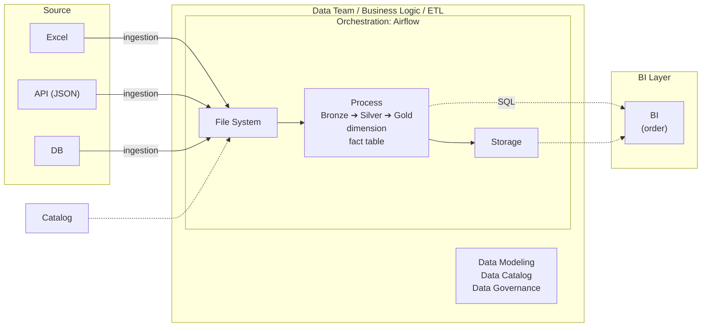

```mermaid
flowchart LR
    subgraph Sources [Source]
        A[Excel]
        B["API (JSON)"]
        C[DB]
    end

    subgraph Data_Team [Data Team / Business Logic / ETL]
        
        subgraph Orchestration [Orchestration: Airflow]
            direction LR
            FS[File System]
            Process["Process<br/>Bronze ➔ Silver ➔ Gold<br/>dimension<br/>fact table"]
            Storage[Storage]

            FS --> Process
            Process --> Storage
        end
        
        %% Floating metadata concepts below the main pipeline
        Gov["Data Modeling<br/>Data Catalog<br/>Data Governance"]
    end

    subgraph BI_Layer [BI Layer]
        BI["BI<br/>(order)"]
    end

    %% Ingestion flows
    A -- ingestion --> FS
    B -- ingestion --> FS
    C -- ingestion --> FS

    %% Catalog pointing towards ingestion/file system boundary
    Catalog[Catalog] -.-> FS

    %% Output to BI
    Process -.->|SQL| BI
    Storage -.-> BI
```